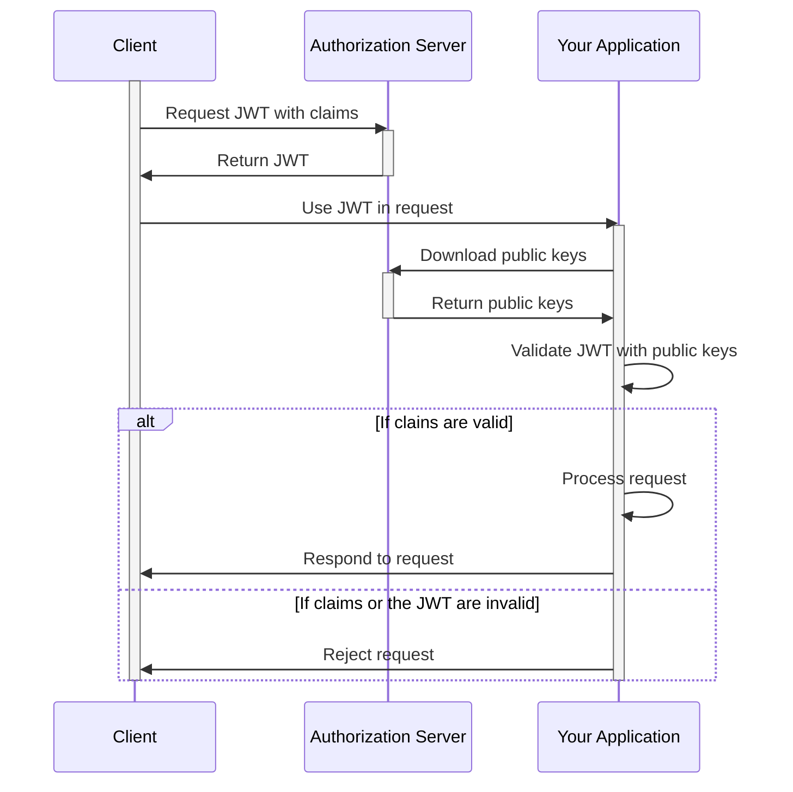

OAuth Server Mock
=================
*OAuth2 mocked server for unit testing*


Features
--------
- Method for signed JWT creation, with user defined claims
- Http endpoint for retrieval of public keys

On a high level, the JWT Bearer Flow of the OAuth2 server mock is as follows:


The purpose of this library is to mock an Authorization Server for unit testing purposes, allowing you to generate JWTs with specific claims and validate them against a mocked server.


Requirements
------------
- Java >= 21

Quick Start
-----------

Gradle
```kotlin
testImplementation("net.uiqui:mock-oauth-server:1.1.3")
```

Maven
```xml
<dependency>
  <groupId>net.uiqui</groupId>
  <artifactId>mock-oauth-server</artifactId>
  <version>1.1.3</version>
  <scope>test</scope>
</dependency>
```

How to Use
----------

1) Create an instance of the OAuthServerMock
```kotlin
private val mockedOauthServer = OAuthServerMock()
```

2) Start the server
```kotlin
@BeforeEach
fun setUp() {
    mockedOauthServer.start()
    every { mockedAuthenticationConfig.jwksEndpoint } returns mockedOauthServer.getJwksUri()
}
```

3) Generate a JWT with the required claims
```kotlin
val requiredClaims = mapOf(
    "iss" to "OAuth-Server-Mock",
    "aud" to "this-unit-test",
    "appid" to "ad4fc666-c793-11ec-9d64-0242ac120002"
)
val jwtToken = mockedOauthServer.generateJWT(requiredClaims)
```

4) Use the JWT on your request
```kotlin
mockMvc.perform(
    get("/your/endpoint")
        .header(AUTHORIZATION, "Bearer $jwtToken")
)
```

5) Shutdown the server
```kotlin
@AfterEach
fun cleanUp() {
    mockedOauthServer.shutdown()
}
```

You can find an example of an application using Spring Boot Security and mock-oauth-server [here](spring-boot-example)


License
-------
This project is licensed under the terms of the [MIT license](https://opensource.org/licenses/MIT)
